# Day40 2022-06-29

## AI 플랫폼을 활용한 웹서비스 개발

### 1. NCP 접속

#### 1. 서버 생성하기

- Classic / Server 로 이동 후 서버 생성 클릭
  - OS 이미지 타입 - CentOS
  - 서버 타입 - Compact 
  - centos-7.2-64 클릭

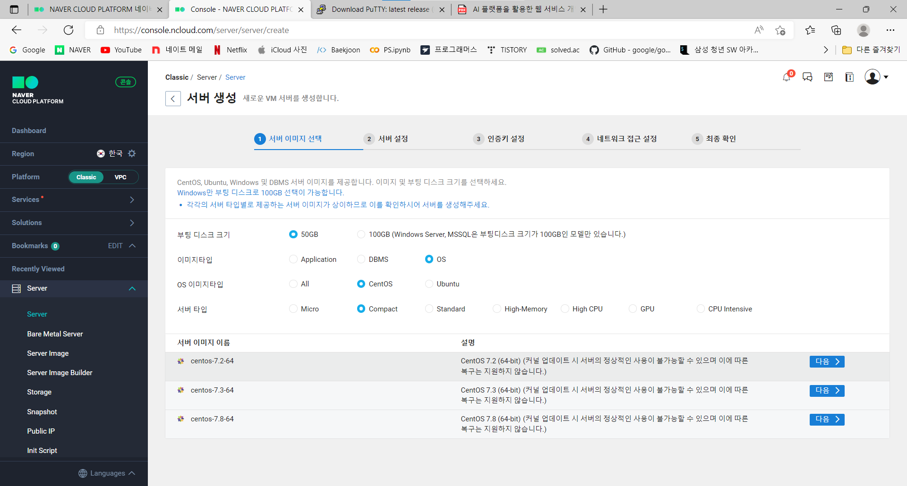

#### 2. 인증키 설정

- 인증키 선택에서 자신의 인증키 선택 후 다음 클릭

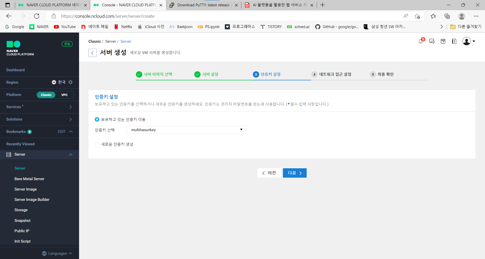

#### 3. 네트워크 접근 설정

- 보유하고 있는 ACG 중에서 자신의 ACG 선택 후 다음 클릭

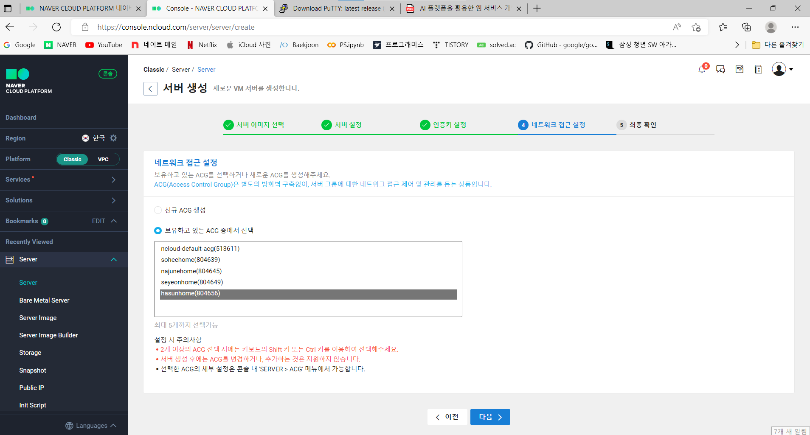

#### 4. 서버 정보 확인

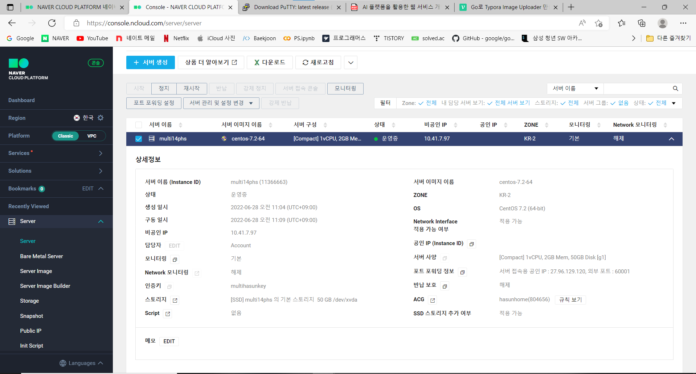

#### 5. 관리자 비밀번호 확인

- 관리자 비밀번호 확인 클릭 후 .pem 파일을 넣어 비밀번호를 확인한다.

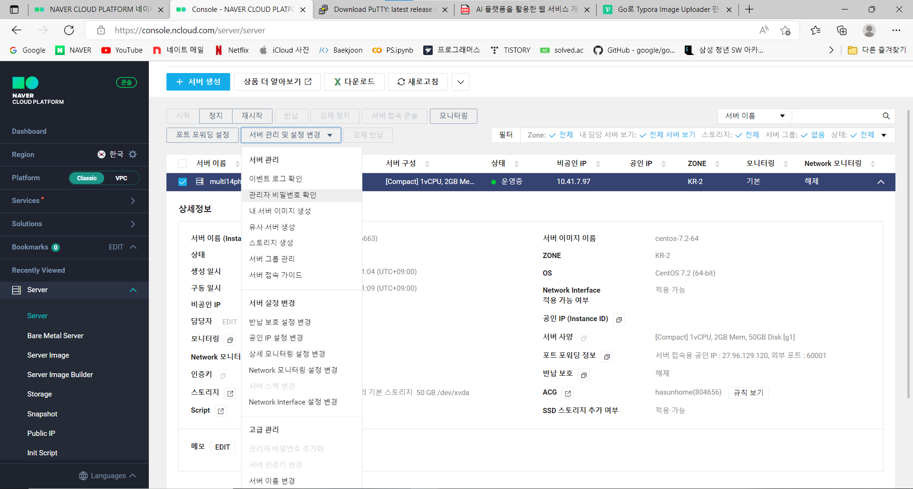

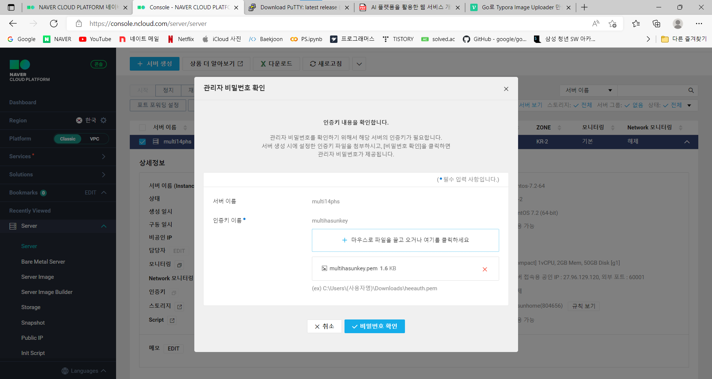

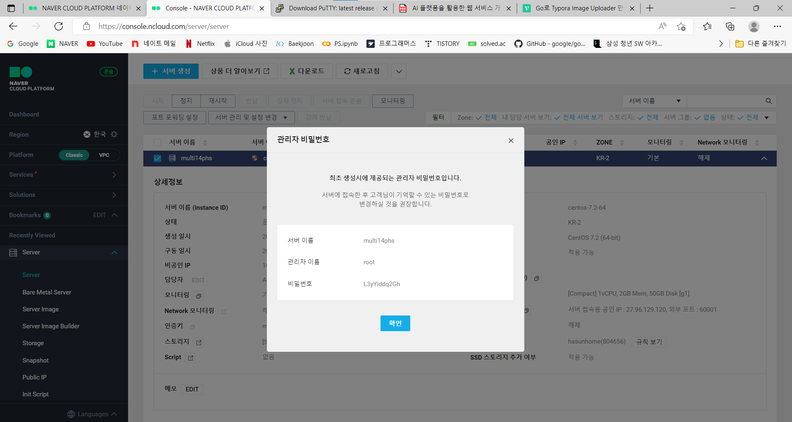

> 이 비밀번호는 최초 1번 입력후 변경하여 다른 비밀번호를 사용한다.

#### 6. 접속 가이드 확인

- 접속 가이드를 확인하여 따라 실행한다.

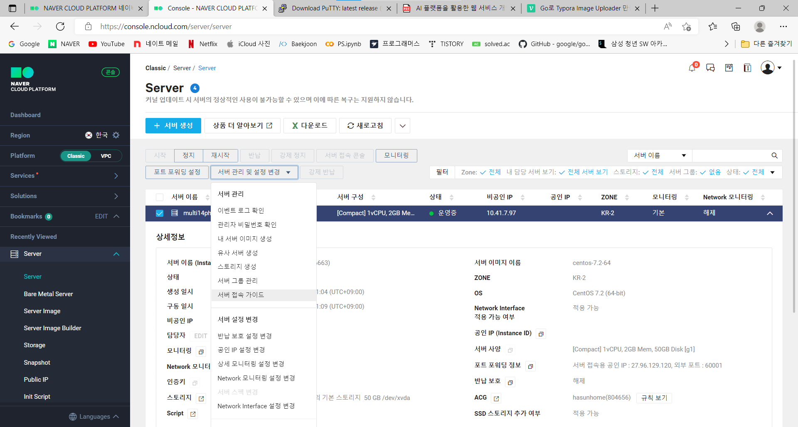

#### 7. 접속하기

- PuTTy를 실행하여 접속 가이드에 나와있는 포워딩 아이디, 포워딩 외부 포트를 입력하여 접속한다.
  - id: root  
  - 비밀번호: 초기 비밀번호  
  - 비밀번호 바꾸기: passwd - 비밀번호 입력

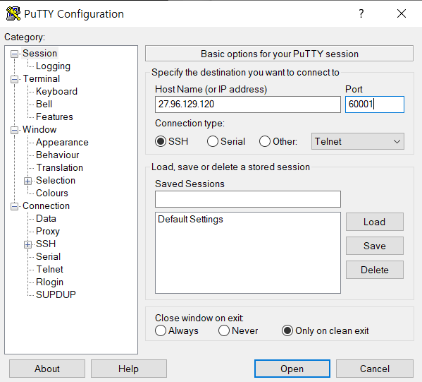

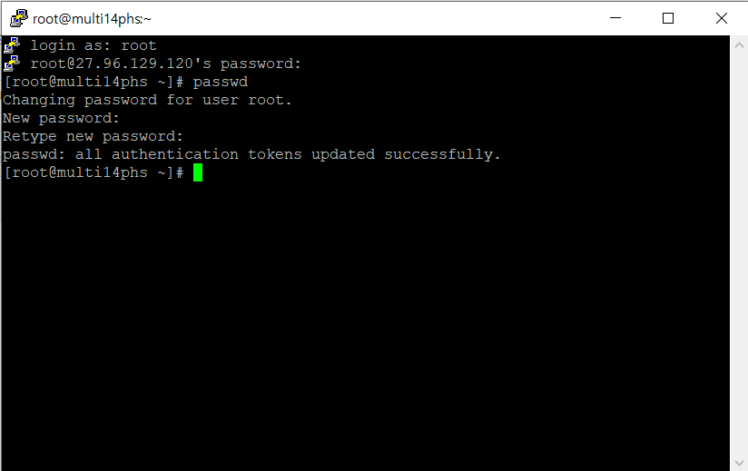

#### 8. 공인 IP 생성

- Public IP 클릭 후 적용 서버 선택, 메모 작성 후 다음 클릭

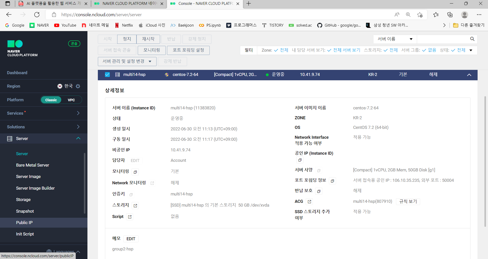

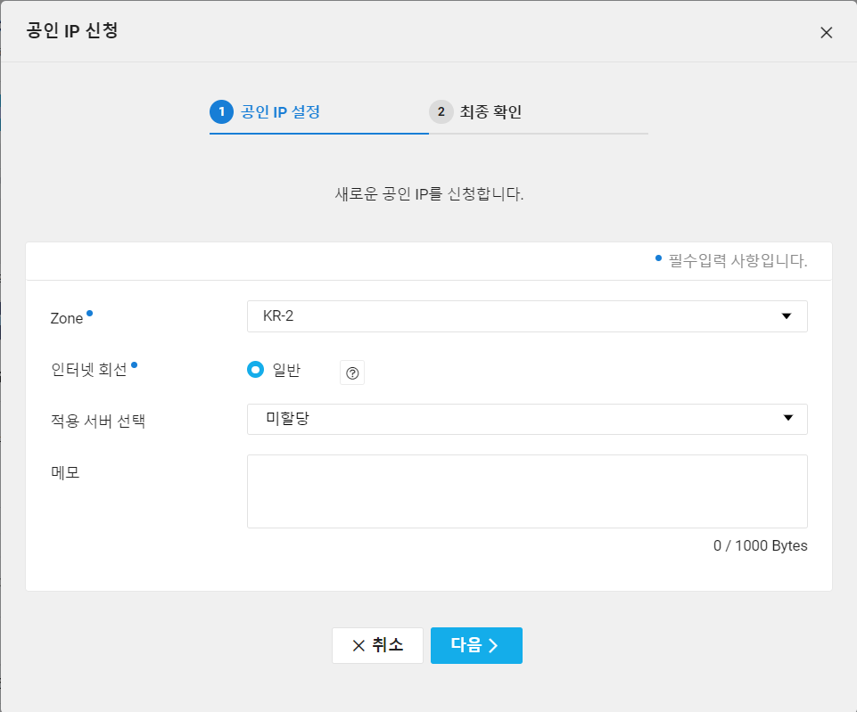

- server에서 확인하기

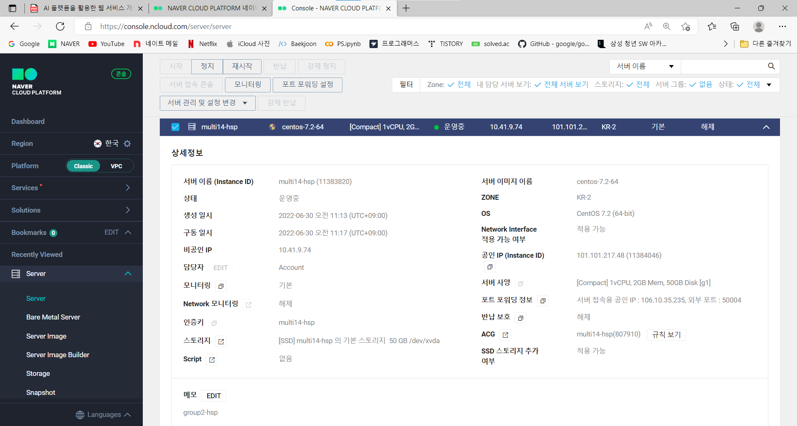

### 2. JDK 1.8 설치

- PuTTy 로그인 후 아래 명령어를 실행한다.

```code
yum  list  java*jdk-devel
yum install  java-1.8.0-openjdk-devel.x86_64

java -version
```

### 3. MySQL 8.0 설치

#### 1. Install

```
yum install -y https://dev.mysql.com/get/mysql80-community-release-el7-5.noarch.rpm

yum repolist enabled | grep "mysql.*"

yum install -y mysql-server

mysql -V
```

#### 2. Configuring Server

- start & stop

```
systemctl enable mysqld # 재부팅 시 자동 시작하도록 설정
systemctl start mysqld # 서비스 시작
systemctl status mysqld # 서비스 구동 여부 확인
```

- Settings root password

```
grep "temporary password" /var/log/mysqld.lo
```

- root 로 접속 후 비밀 번호 변경

```
mysql -u root -p

mysql> ALTER USER 'root'@'localhost' IDENTIFIED BY '변경할 비밀번호';
mysql> exit;
```

> 반드시 영문 대소문자, 숫자, 특수 문자를 구분한다.

- 비밀 정책 변경

```
mysql -u root -p

mysql> SHOW VARIABLES LIKE 'validate_password%';
mysql> SET GLOBAL validate_password.length = 5; # 다섯자리까지만
mysql> SET GLOBAL validate_password.number_count = 0; # 숫자 x
mysql> SET GLOBAL validate_password.policy=LOW; # 정책 수준 낮게
mysql> SET GLOBAL validate_password.mixed_case_count = 0; # 대소문자 x
mysql> SET GLOBAL validate_password.special_char_count = 0; # 특수문자 x
```

- 사용자 생성 및 데이터베이스 생성

```
mysql -u root -p

mysql> use mysql;
mysql> select host, user from user;

mysql> CREATE USER '아이디'@'%' identified by '비밀번호'; # 외부접속만 가능한 계정 생성
mysql> CREATE DATABASE DB이름 default character set utf8;
mysql> GRANT ALL PRIVILEGES ON DB이름.* to '아이디'@'%'; # 해당 DB에 대한 권한 부여
mysql> flush privileges; # 새로고침
mysql> select host,user from user; # 다시 확인
```

### 4. Apach-Tmocat 설치

JDK 1.8 설치 후 진행

#### 1. Download

```
wget http://archive.apache.org/dist/tomcat/tomcat-8/v8.5.27/bin/apache-tomcat-8.5.27.tar.gz
```

#### 2. 압축 해제

```
tar zxvf apache-tomcat-8.5.27.tar.gz
ls
```

#### 3. 실행

```
cd /root/apache-tomcat-8.5.27/bin
./startup.sh         -실행
./shutdown.sh      -정지
```

#### 4. 실행 확인

```
ps -ef | grep tomcat
```

