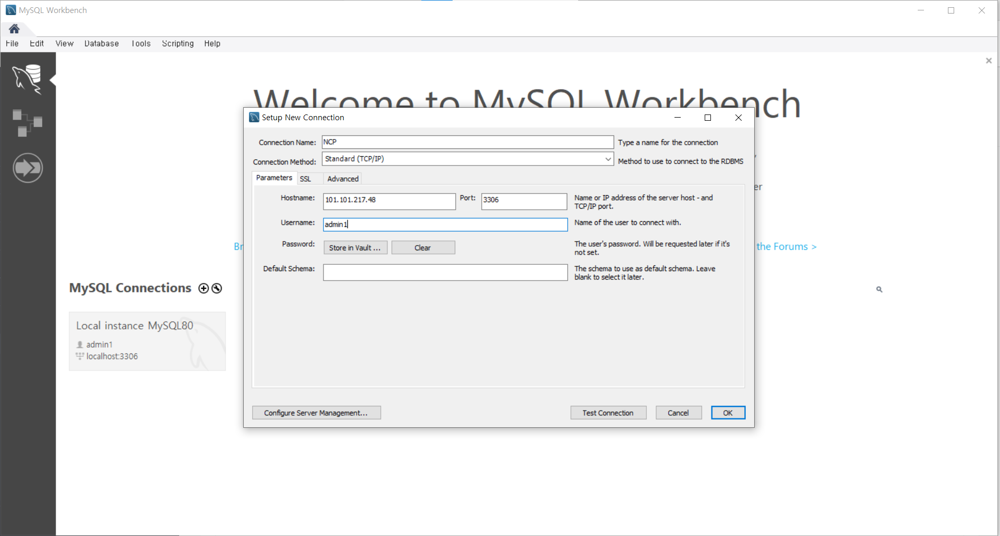
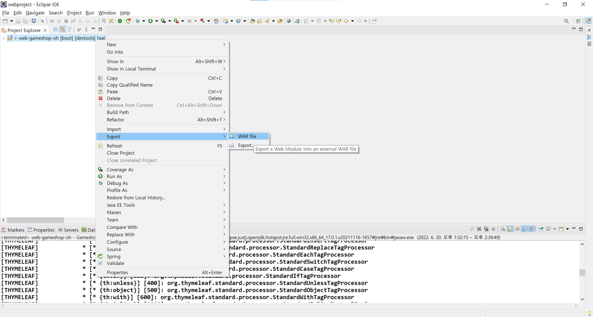
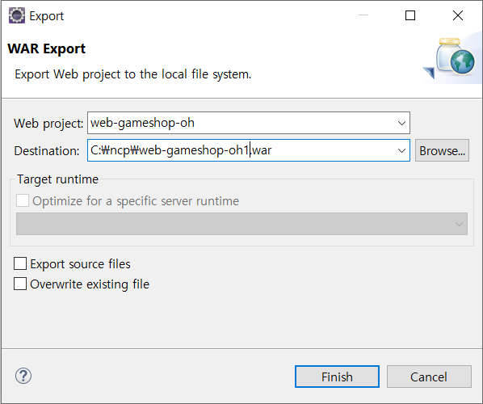

# Day41 2022-06-30

## AI 플랫폼을 활용한 웹서비스 개발

### LinuxOS (CentOS) 기본 명령어

#### 1. vi 편집기 실행

- vi test.txt - test.txt 파일이 있으면 실행되고, 없으면 새로 만들어서 실행
- w - write
- q - quit

#### 2. 파일 내용 확인

- cat "파일 이름. 파일 형식"

#### 3. 파일 및 디렉토리

1. 디렉토리 변경

   - 절대 패스 - cd /home/student

   - 상대 패스 - cd ../home/student

   - 현재 작업 디렉토리의 위치와 상관없이 홈 디렉토리로 이동 - cd

2. 현재 작업 디렉토리 절대 패스로 출력

   - pwd

3. 디렉토리 파일목록 출력

   - ls "디렉토리명" - 간단히 보기
   - ls -l - 자세히 보기
   - ls -a - 숨김파일 보기 (.으로 시작하는 파일)
   - ls -al - 숨김파일까지 자세히 보기

   > -al로 표시되는 파일은 파일의 종류, 접근 권한, 링크 수, 소유 그룹, 파일 크기, 마지막 수정일시, 숨김파일 등으로 나옴

4. 디렉토리 생성 및 삭제

   - mkdir "디렉토리 이름" - 생성
   - rmdir "디렉토리 이름" - 삭제 (디렉토리 안에 다른 파일이나 디렉토리가 존재하지 않아야만 가능)

5. 파일 복사, 삭제, 파일 및 디렉토리 이동

   - cp "파일명.확장자" "(복사한)파일명.확장자" - 복사
   - rm "파일명.확장자" - 삭제
   - mv "파일명.확장자" "이동할 경로"/"(변경가능)파일명.확장자" - 이동
   - mv "이동할 대상" "디렉토리 이름" - 이동

   > 이동할 대상의 이름은 그대로 유지

6. file 종류 표시

   - file 대상 파일 경로 (혹은 파일 경로 패턴)

7. 파일 찾기

   - find 검색 시작 위치 -name "파일명 패턴" - 특정 파일 패턴명 패턴을 갖는 파일들을 검색해서 지우기
   - find 검색 시작 위치 -name "파일명 패턴" - 삭제

8. 파일 내려받기

   - wget 다운로드URL

   > 이상하게 저장되어 있는 경우가 있어서 다음 명령어 많이 사용함

9. 다른 이름으로 저장하기

   - wget -O 저장될 파일이름 다운로드URL

10. 이어받기

    - wget -c 다운로드URL

11. 압축하기

    - tar zcvf 생성될압축파일이름 압축할원본파일 혹은 디렉토리

12. 해제하기

    - tar zxvf 압축파일_이름
    - c - 새로운 묶음 만들기
    - x - 묶인 파일 풀어줌
    - f - 묶음 파일의 이름 지정 옵션
    - v -  묶음 파일을 풀거나 묶을 때 과정을 화면에 출력

13. zip 명령어 압축 / 해제

    - zip 압축파일 이름 압축대상 파일 이름
    - unzip - 파일 이름
    - gzip - 명령어와 달리 묶음 파일을 거치지 않고 바로 압축 / 해제 가능

### MySQL Connection 생성하기

- `+` 버튼 클릭
- Name : NCP
- Hostname : 공인 IP
- Port : 3306
- Username : admin1



### 데이터 소스 연결하기

- datasource.url 에 공인 IP, DB 이름을 입력한다.
- username, password를 입력한다.

```properties
server.port=80

spring.datasource.driverClassName=com.mysql.cj.jdbc.Driver
spring.datasource.url=jdbc:mysql://101.101.217.48:3306/gameshopdb?serverTimezone=Asia/Seoul

spring.datasource.username=admin1
spring.datasource.password=111111

mybatis.type-aliases-package=com.multi.vo
mybatis.mapper-locations=com/multi/mybatis/*.xml
```

### WAR 파일 다운받기

1. 프로젝트 오른쪽 마우스 클릭 - Export - WAR File 클릭



2. Web project 이름과 Destination에 저장 위치를 입력한다.



### PC 파일 전송 압축 해제

1. 명령 프롬프트 실행 후 디렉토리를 zip 형태로 묶은 파일 전송

```
scp -P 65500 a.zip root@101.101.167.122:/root
```

2. CentOS 접속 후 압축 해제

```
unzip  a.zip
```

