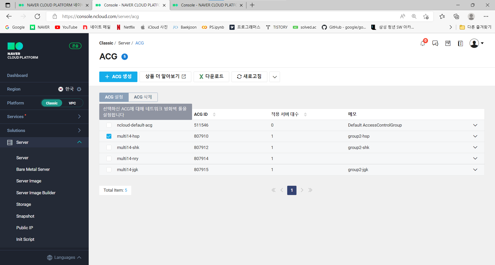
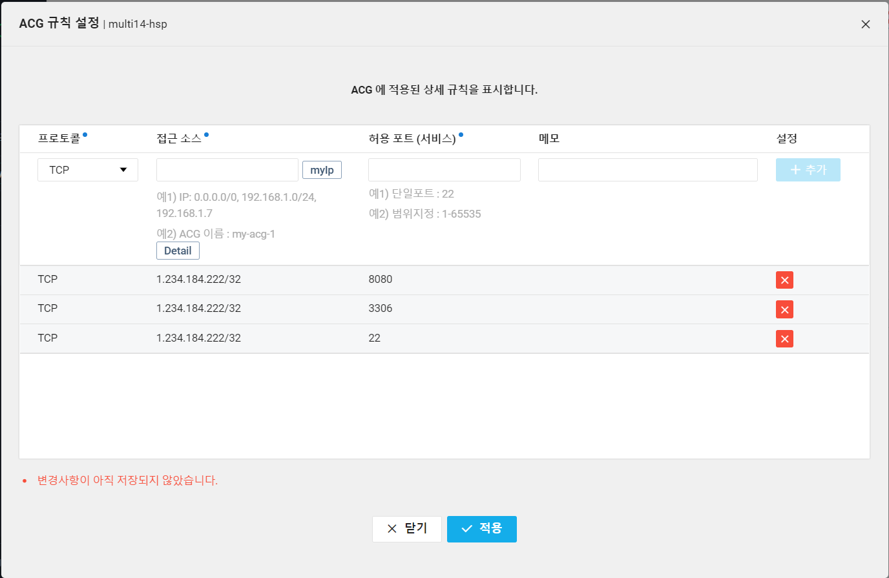
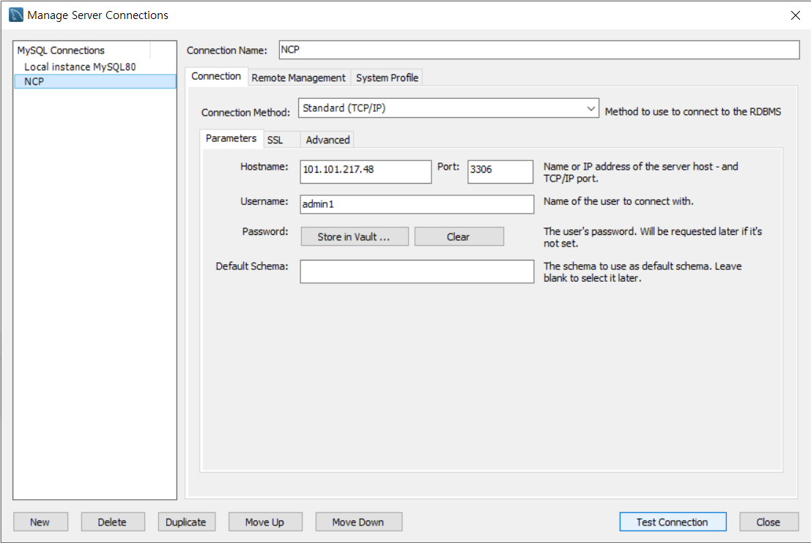

# Day42 2022-07-01

## AI 플랫폼을 활용한 웹서비스 개발

### 보안상의 문제 해결하기

접근 소스 : 0.0.0.0/0, 허용 포트 : 1-65535로 설정하였더니 다른 사람이 접속하는 보안상의 문제가 발생

#### 1. ACG 설정하기

1. ACG - 자신의 ACG 선택 - ACG 설정으로 이동



2. myip 클릭하고 허용 포트에 22, 3306(mysql), 8080을 추가



#### 2. PC 파일 전송 압축 해제

1. 명령 프롬프트 실행 후 zip 파일 전송

```
scp -P 22 a.zip root@101.101.217.48:/root
```

2. CentOS 접속 후 압축 해제

```
unzip  a.zip
```

#### 3. MySQL 설정

- Hostname : 공인 IP
- Port : 3306



> 이제 접속 시 포워딩 사용하지 않고, 공인 IP 사용